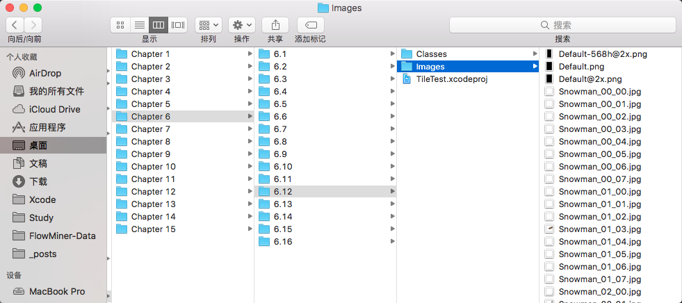

# iOS-Core-Animation-Advanced-Techniques-Resource
包含 iOS Core Animation: Advanced Techniques 一书的官方源码和图片素材.

# 注意
里面的章节和GitBook上的译文是对应的,但是具体小节可能有点区别.
例如, 如果你想找6.7 CATiledLayer中雪人的切图,可以从下面路径看到

# 附录
译文地址[iOS核心动画高级技巧](https://github.com/AttackOnDobby/iOS-Core-Animation-Advanced-Techniques)

GitBook地址[iOS核心动画高级技巧 on GitBook](https://zsisme.gitbooks.io/ios-/)